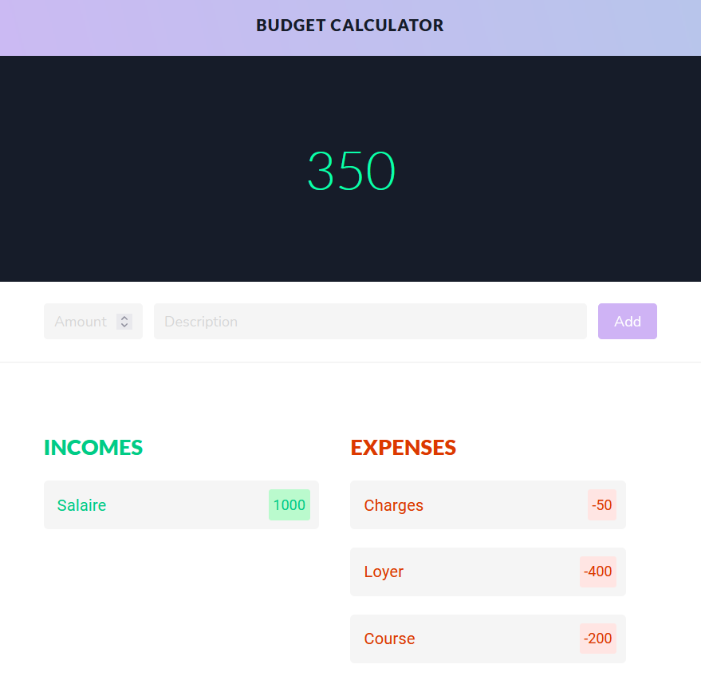

# Création d'une application pour la gestion d'un budget

## Description
Découverte d'Angular par le biais de la vidéo "Angular - Build a Budget Calculator Application" faites par Devstackr.
La video permet la réalisation d'une page qui réalise une gestion d'un budget. Elle permet d'entrer des valeurs en entrée et sortie d'argent. On peut modifier les valeurs d'argent qui ont été entrée.

Ce projet m'a permis de découvrir le fonctionnement d'Angular, la relation entre les fichiers et les composants.

## Réalisation

<h2>Page Principale</h2>

<h2>Modal de modification des valeurs</h2>

